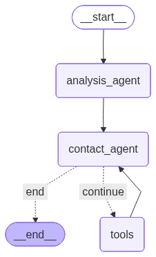

#  ME4101A Agent Pipeline 

A complete agent pipeline that helps with condition monitoring and helps alert Senior engineer in case the Gearbox is in any undesirable condition

## Project Purpose 
This projects main aim is to create an end to end web application that collects data (simulated) from a vibration accelerometer stored in a CSV file. File is then validated through a two Custom Machine Learning Models using Psychoacoustic Loudness and Psychoacoustic Sharpness Parameters. Once validation is complete, AI Agent will send out email notification to the Head Engineer to inform validation is done. In the scenario that it requires repair due to defects, AI Agent will send a Email alert to the maintenance Engineer for a inspection Request. 

## Background Worker
Tools like **Celery** and **Redis** are deployed to perform background tasks. This background task activates the Data Extraction, Validation and Agent processes in one go, without having the need for users to wait 

## Psychoacoustic Extraction
Uploaded data file will run through **MATLAB** Engine, via python, which will perform data extraction and saves them into two seperate files for Loudness and Sharpness 

## Validaiton
Tensorflow and Keras Libraries are used to reactive the saved CNN models for Loudness and Sharpness. Thereafter Prediction takes place for each sample and the overall predicted class will be saved and sent to the AI Agent 

## AI Agent 
Using **Langgraph** and **Langchain**, a robust AI Agent workflow is craeted where the predicted classes are passed over to the AI agent and it will be responsible for sending email notifications either to the Senior Engineer or Maintenance Team if an inspection is required. **OpenAI** is used as the main Large Language Model Provider. **Pydantic** is used for creating a structured output. 

# Credits
This project is part of My Final Year Project in NUS titled "Psychoacoustic Analysis for Machinery Fault Detection" 

**Mohamed Shervin**

Admission: **A0284579H** 